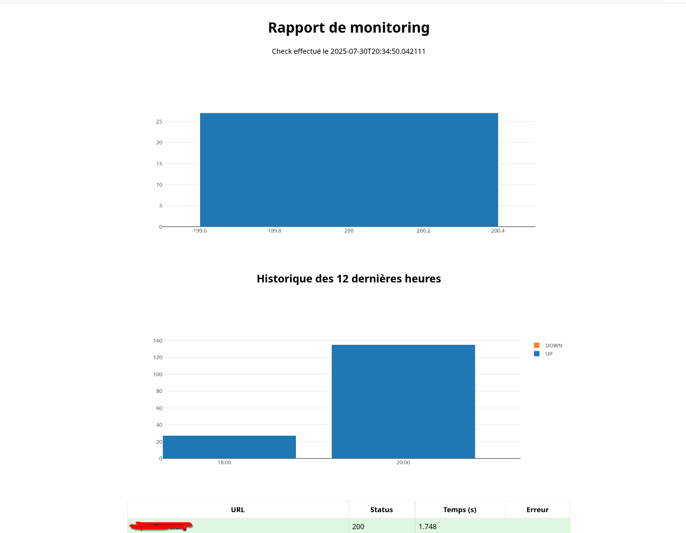

# Zangbéto – Night Guardian

<p align="center">

</p>

[Zangbéto](https://en.wikipedia.org/wiki/Zangbeto) is a lightweight and local website monitoring tool. It periodically checks the availability of static and dynamic pages, generates detailed HTML reports, and sends notifications when incidents occur.

## How It Works

Zangbéto operates as a **recursive web crawler** that monitors your websites' health automatically. Here's what happens during each monitoring cycle:

1. **Site Discovery**: Starting from your configured URLs (in `sites.txt`), Zangbéto explores each website by following internal links up to a configurable depth (default: 2 levels)

2. **Health Checks**: For every discovered page, it performs HTTP requests measuring:
   - Response time (how fast your site responds)
   - Status codes (200 OK, 404 Not Found, 500 errors, etc.)
   - Availability (can the page be reached?)

3. **Data Storage**: All results are stored in a local SQLite database with timestamps, creating a historical record of your website's performance

4. **Report Generation**: After each check, an interactive HTML report is generated using Plotly charts showing:
   - Current status overview with success/failure rates
   - Status code distribution (pie charts)
   - 12-hour trend analysis (up/down over time)
   - Detailed page-by-page results with response times

5. **Smart Notifications**: 
   - **Instant alerts** for failures (via desktop notifications)
   - **Scheduled reports** (every 12 hours by default) with clickable notifications to open the full report
   - Support for multiple channels: system notifications, email, Slack, Telegram

**Example scenario**: You add `https://mycompany.com` to your sites list. Zangbéto will check the homepage, then follow links to `/about`, `/contact`, `/products`, etc., testing each page every 30 minutes. If any page becomes slow or returns errors, you'll get an immediate notification. Every 12 hours, you'll receive a comprehensive report showing trends and overall health.

This approach gives you **comprehensive coverage** of your entire website ecosystem, not just individual URLs, while maintaining **historical data** for trend analysis and **proactive alerting** for quick incident response.

## 📦 Tech Stack

* **Language**: Python 3+
* **HTTP**: `requests`
* **Parsing**: `BeautifulSoup4`
* **Scheduling**: `schedule` (portability)
* **Database**: SQLite (`sqlite3`)
* **Templates**: Jinja2
* **Charts**: Plotly.js (via CDN)
* **Notifications**: `notify-send` (Email (SMTP), Slack, Telegram support in testing)
* **Linux Supervision**: systemd (unit + timer)

**Note**: `notify-send` is available on Linux desktops (default on most distributions)

### Installing notify-send

**Ubuntu**
```bash
sudo apt install libnotify-bin
```

**Fedora**
```bash
sudo dnf install libnotify
```

**Arch Linux**
```bash
sudo pacman -Sy libnotify
```

## Project Structure

```
Zangbeto/
├── main.py                    # Main script and CLI
├── crawler.py                 # Web exploration and HTTP tests
├── notifications.py           # Asynchronous notification manager
├── templates/
│   └── report_template.html   # Jinja2 template for reports
├── history.db                 # SQLite database for check history
├── requirements.txt           # Python dependencies
└── README.md                  # Documentation and usage guide
--  setup.sh                   # Bash  File for setuping project and configure systemd automatically

```

## Quick Start Guide

1. **Clone and setup**:
   ```bash
   git clone https://github.com/yourusername/zangbeto
   cd zangbeto
   python3 -m venv venv
   source venv/bin/activate
   pip install -r requirements.txt
   ```

2. **Configure sites** - Create `sites.txt`:
   ```bash
   echo "https://your-website.com" > sites.txt
   echo "https://your-api.com" >> sites.txt
   ```

3. **Test the setup**:
   ```bash
   # Quick test - single check
   python main.py --one-shot
   ```

4. **Start monitoring**:
   ```bash
   # Continuous monitoring
   python main.py
   ```

That's it! Open the generated `rapport.html` in your browser to see the monitoring results.

## Configuration

### Sites Configuration
Create a `sites.txt` file with URLs to monitor (one per line):
```
https://example.com
https://mycompany.org
https://api.myservice.net
```

### CLI Arguments

**Basic Options:**
* `-f`, `--frequency`: Check interval in minutes (default: 30)
* `-o`, `--output`: HTML report file path (default: `rapport.html`)
* `-i`, `--interval`: Interval in hours for complete report notifications (default: 12)

**Execution Modes:**
* `-c`, `--count`: Run a specific number of check cycles then exit (default: infinite)
* `--one-shot`: Run a single check and exit (equivalent to `--count 1`)

### Environment Variables (Optional)
For extended notifications, set these in a `.env` file:
```bash
# Email notifications
SMTP_HOST=smtp.gmail.com
SMTP_PORT=587
SMTP_USER=your-email@gmail.com
SMTP_PASSWORD=your-app-password

# Slack notifications
SLACK_WEBHOOK_URL=https://hooks.slack.com/services/...

# Telegram notifications
TELEGRAM_BOT_TOKEN=123456789:ABC-DEF...
TELEGRAM_CHAT_ID=123456789
```

## Usage

### Continuous Monitoring 
```bash
# Start continuous monitoring (runs forever until Ctrl+C)
python main.py

# Custom frequency - check every 10 minutes
python main.py --frequency 10

# Custom report interval - send reports every 6 hours
python main.py --interval 6
```

### Limited Monitoring (Testing)
```bash
# Quick test - single check with immediate report
python main.py --one-shot

# Run exactly 5 check cycles then exit
python main.py --count 5

# Test with custom settings
python main.py --one-shot --frequency 1 --output test_report.html
```

### Output Examples
* **Reports**: Generated as interactive HTML files with charts (`rapport.html` by default)
* **Notifications**: Desktop notifications for failures, clickable notifications for reports
* **Console**: Real-time progress and status information



**Example console output:**
```
2025-01-30 10:30:15 - INFO - Starting check job #1 of 3
2025-01-30 10:30:18 - INFO - Loaded 2 sites to monitor
2025-01-30 10:30:22 - INFO - Site exploration completed: 8 pages found
2025-01-30 10:30:23 - INFO - All sites are healthy
2025-01-30 10:30:23 - INFO - Check job #1 completed
```

## 🔧 systemd Integration (Linux)

For execution in background, integrate with systemd for automatic startup and management:

0. **You can setup automatically with `setup.sh`**
```bash
chmod +x setup.sh
./setup.sh #
```
OR 

1. **Create service files** - Copy from `systemd/` folder:
   ```bash
   sudo cp systemd/zangbeto.service /etc/systemd/system/
   sudo cp systemd/zangbeto.timer /etc/systemd/system/
   ```

2. **Enable and start**:
   ```bash
   sudo systemctl daemon-reload
   sudo systemctl enable zangbeto.timer
   sudo systemctl start zangbeto.timer
   ```

3. **Monitor and manage**:
   ```bash
   # Check timer status
   systemctl list-timers --all | grep zangbeto
   
   # View logs
   journalctl -u zangbeto.service -f
   
   # Manual run
   sudo systemctl start zangbeto.service
   ```

This setup ensures Zangbéto runs automatically on system boot and restarts on failures.

## What About Testing APIs (REST APIs for Now)?

That’s a great question because nowadays, most modern web applications are split into two main components: the backend (API) and the frontend.

When it comes to monitoring or testing APIs in production, there are generally two main approaches:

1. **Direct API testing**, where requests are made directly to the live endpoints.  
   This method carries risks such as:
   - Modifying production data
   - Triggering authentication or authorization issues  
   While manageable, it can raise security and data integrity concerns.

2. **Internal health-check endpoints**, where one or more special routes are created specifically for monitoring purposes.  
   These endpoints:
   - Perform internal checks on other routes or logic
   - Return a summary or detailed result about system health  

The second approach is often safer and cleaner:
- No side effects on production data
- Fewer security concerns
- Easier to automate and monitor

 Future versions of this project aim to support both website and API monitoring, including health-check mechanisms for REST APIs.

## Alternatives

Yeah, there are plenty of alternatives out there. For medium to large teams, robust monitoring and alerting tools like **[Grafana](https://github.com/grafana/grafana)**, **[Prometheus](https://github.com/prometheus/prometheus)**, and others are already widely used—and they do their job very well.

This project is not meant to be a drop-in replacement for those tools (just look at how small it is, haha). Instead, it’s a lightweight solution I built to quickly check if my websites are down, even quietly in the background.

That said, I’m always open to better suggestions and contributions.


## 📝 Roadmap (v2+)

**Core Improvements:**
* Unit tests and CI/CD pipeline
* Asynchronous crawler for better performance
* Dynamic pages support (Playwright/Selenium)
* Advanced retry logic and timeout handling

**Reporting & Visualization:**
* Improving the default UI report
* Automatic PDF export
* Real-time web dashboard (Flask/React)
* Custom alert thresholds and rules
* SLA tracking and uptime calculations
* Custom templates definition and usage

**Notifications & Integrations:**
* Other channels Support (SMS, Discord, Teams ...)
* Webhook support for custom integrations
* Alert escalation policies
* Maintenance windows and alert suppression

**Other Features:**
* Multi-user authentication and role management
* API monitoring with JSON/XML validation
* Protected sites monitoring (login flows)


**Platform & Deployment:**
* Windows support and native installers


**Data Management:**
* Advanced retention policies and data purging 

* Performance metrics and trends analysis

---

*Zangbéto – Version 1.0.0*